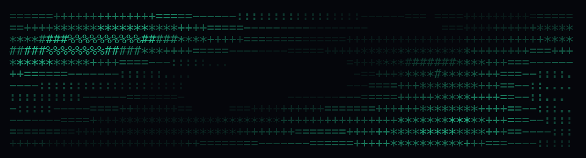
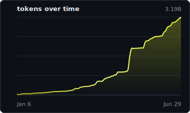

  

hi! i'm ganesh and below you can find most of the projects i've worked on throughout the years (all the way back to 2021!)

for my full profile, visit [ganeshtalluri.com](https://ganeshtalluri.com/)

<!-- codex-token-counter:start -->
#### my yearly codex usage

<table width="100%">
  <thead>
    <tr>
      <th align="left" width="18%">stat</th>
      <th align="left" width="36%">value</th>
      <th align="right" width="46%">tokens over time</th>
    </tr>
  </thead>
  <tbody>
    <tr>
      <td width="18%">tokens</td>
      <td width="36%">9,278,691,698 (9.28B)</td>
      <td rowspan="7" width="46%" valign="middle" align="right"></td>
    </tr>
    <tr>
      <td>cost</td>
      <td>$12,739.28</td>
    </tr>
    <tr>
      <td>active days</td>
      <td>118</td>
    </tr>
    <tr>
      <td>sessions</td>
      <td>926</td>
    </tr>
    <tr>
      <td>top model</td>
      <td>gpt-5.6-sol</td>
    </tr>
    <tr>
      <td>range</td>
      <td>Jan 1, 2026 -&gt; Jul 21, 2026</td>
    </tr>
    <tr>
      <td>updated</td>
      <td>Jul 21, 2026, 12:04 AM MST</td>
    </tr>
  </tbody>
</table>

auto-refreshes once daily when this Mac is available via ccusage; graph and banner colors randomize daily
<!-- codex-token-counter:end -->
