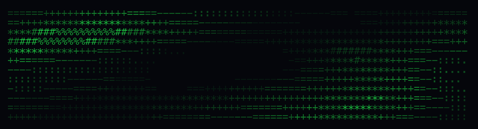
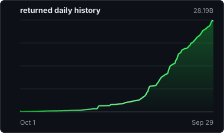

  

hi! i'm ganesh and below you can find most of the projects i've worked on throughout the years (all the way back to 2021!)

for my full profile, visit [ganeshtalluri.com](https://ganeshtalluri.com/)

<!-- codex-token-counter:start -->
#### my codex usage across devices

<table width="100%">
  <thead>
    <tr>
      <th align="left" width="18%">stat</th>
      <th align="left" width="36%">value</th>
      <th align="right" width="46%">tokens over time</th>
    </tr>
  </thead>
  <tbody>
    <tr>
      <td width="18%">lifetime tokens</td>
      <td width="36%">27,079,419,660 (27.08B)</td>
      <td rowspan="6" width="46%" valign="middle" align="right"></td>
    </tr>
    <tr>
      <td>est. API cost</td>
      <td>$36,598.21</td>
    </tr>
    <tr>
      <td>current streak</td>
      <td>87 days</td>
    </tr>
    <tr>
      <td>daily history</td>
      <td>Oct 1, 2025 -&gt; Sep 26, 2026</td>
    </tr>
    <tr>
      <td>history tokens</td>
      <td>27,054,350,578</td>
    </tr>
    <tr>
      <td>updated</td>
      <td>Sep 26, 2026, 6:03 PM MST</td>
    </tr>
  </tbody>
</table>

OpenAI account lifetime counter; updates periodically when this Mac is available. Cost is an estimate using a fixed historical average, not a bill. The graph covers only returned daily history (27,054,350,578 tokens), which may differ from lifetime usage. <a href="./launchd/README.md#account-tokens-and-estimated-cost">Method and pricing</a>.
<!-- codex-token-counter:end -->
